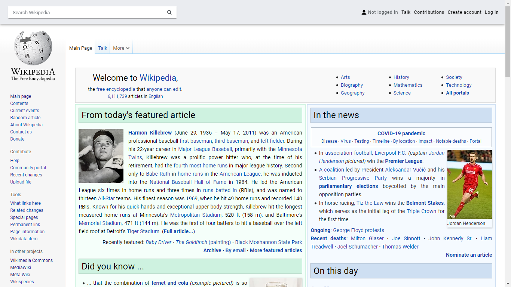

# Material Vector

[](screenshot.png)

Modified CSS of [MediaWiki](https://www.mediawiki.org/)'s default skin [Vector](https://www.mediawiki.org/wiki/Special:MyLanguage/Skin:Vector) used by me on [Wikimedia Foundation](https://wikimediafoundation.org/) projects (like [Wikipedia](https://www.wikipedia.org/), [Commons](https://commons.wikimedia.org/), etc.) and possible other MediaWiki-based websites using Vector skin with inspiration in [Material Design](https://material.io/design/).

## Files

* [`global.css`](global.css) - global stylesheet used in all wikis with Vector skin
* [`material-vector.user.css`](material-vector.user.css) - to use with [Stylish](#stylish) / [Stylus](#stylus) browser extension
* [`wikipedia.css`](wikipedia.css) - invert the [Wikipedia logo](https://commons.wikimedia.org/wiki/File:Wikipedia-logo-v2-en.svg) for the dark mode (the code can be reused with other wikis, but it can't get the same effect like it does on the Wikipedia logo)
* [`wikipedia-pt.css`](wikipedia-pt.css) - applies only to [Portuguese Wikipedia](https://pt.wikipedia.org/)

## Features

* Sticky navbar with user actions, notifications, and search bar
* Page actions positioned at the left side
* Improved [table of contents](https://www.mediawiki.org/wiki/Special:MyLanguage/Manual:Table_of_contents) styles
* Content text justified with automatic hyphenation (hyphenation only works with Chromium-based browsers on macOS and Firefox)
* [Dark mode](#dark-mode) (preliminary support)
* Use globally: Material Vector don't override other MediaWiki skins customized styles

_Specific for the Portuguese Wikipedia_

* Improved [infobox](https://pt.wikipedia.org/wiki/Ajuda:Infocaixa) styles
* Removes [country flags icons](https://pt.wikipedia.org/wiki/Wikip%C3%A9dia:Projetos/Predefini%C3%A7%C3%B5es_de_bandeiras) (works with most, but no removes flags without `.flagicon`)
* Gadget: [FastButtons](https://pt.wikipedia.org/wiki/Wikipédia:Scripts/FastButtons) are now "materialized" buttons

## Installing

### Using MediaWiki

MediaWiki have built-in [custom user stylesheets](https://www.mediawiki.org/wiki/Special:MyLanguage/Manual:Interface/Stylesheets) support. If this [feature has been activated](https://www.mediawiki.org/wiki/Special:MyLanguage/Manual:$wgAllowUserCss), you must create `User:`_`YourUsername`_`/common.css` (or  `User:`_`YourUsername`_`/vector.css`) page with the contents of `global.css`. To enable it on all Wikimedia wikis, you must create a page at https://meta.wikimedia.org/wiki/Special:MyPage/global.css.

### Using a browser extension

#### Stylus

Install [Stylus](https://add0n.com/stylus.html), available on [Chrome Web Store](https://chrome.google.com/webstore/detail/stylus/clngdbkpkpeebahjckkjfobafhncgmne) for Google Chrome, Microsoft Edge (enable [Allow extensions from other stores](https://support.microsoft.com/help/4538971) option) or other [Chromium-based browser](https://en.wikipedia.org/wiki/Chromium_%28web_browser%29#Browsers_based_on_Chromium), on [Mozilla Addons](https://addons.mozilla.org/firefox/addon/styl-us/) for Firefox and [Opera Addons](https://addons.opera.com/extensions/details/stylus/) for Opera. Them, access `material-vector.user.css` [from here](https://raw.githubusercontent.com/gabrieldelsaint/material-vector/master/material-vector.user.css) and click on "Install style" button.

##### Note
Stylus doesn't support `@import` CSS at-rule that Material Vector uses to get [Roboto](https://fonts.google.com/specimen/Roboto) and [Roboto Mono](https://fonts.google.com/specimen/Roboto+Mono) webfont (for the users that doesn't have these typefaces installed) from [Google Fonts](https://fonts.google.com/) within `@-moz-document` Mozilla Format at-rule, used to specify the URLs that the stylesheets will be applied. 

For best viewing the theme, you can add the below code on Stylus by clicking into the extension icon, option "Open style manager", then click on "Material Vector" and choose "Import" option on "Mozilla Format" section. After that, copy the code and click on "Append to style" button.

```css
@import url("https://fonts.googleapis.com/css?family=Roboto:400,100,100italic,300,300italic,400italic,500,500italic,700,700italic,900,900italic|Roboto+Mono:400,100,100italic,300,300italic,500,400italic,500italic,700,700italic|Cabin:400,400italic,500,500italic,600,600italic,700,700italic&subset=latin,greek,cyrillic,greek-ext,vietnamese,cyrillic-ext,latin-ext");
```

This stylesheet will be loaded on all pages that you visit, but not affects it. You also can manually specific URLs that will be used with these fonts.

Alternatively, you can download and install these typefaces from Google Fonts: [Roboto](https://fonts.google.com/download?family=Roboto) / [Roboto Mono](https://fonts.google.com/download?family=Roboto%20Mono).

* On Windows, unzip downloaded files and copy fonts to C:\Windows\Fonts folder or open Settings (<kbd>Win</kbd>+<kbd>I</kbd>), click on "Personalization", then "Fonts" and drag fonts files to the Settings window

If you don't care about this issue, your system default font will be displayed instead.

## Dark mode

### Setting under browser

* __Chrome__: dark mode must be enabled on the OS settings ([support page](https://support.google.com/chrome/answer/9275525))
* __Firefox__: dark mode must be enabled on the OS settings or using `ui.systemUsesDarkTheme` property of `about:config`, setting "1" (without quotes) number value ([support page for `about:config`](http://mzl.la/1U8c8gM))
* __Edge__: open the menu "Settings and more" (<kbd>Alt</kbd>+<kbd>F</kbd>), choose "Settings", then "Appearance", and select "Dark" option on "Default theme" section ([support page](https://support.microsoft.com/help/4533310))

### Setting under OS

_To work correctly within Microsoft Edge, use "System default" option on the browser settings_

* __Windows 10__ <small>(version 1607 (Anniversary Update) or latter)</small>: open Settings (<kbd>Win</kbd>+<kbd>I</kbd>), then "Personalization" > "Colors", and select "Dark" option on "Choose your default Windows mode" section ([support page](https://support.microsoft.com/help/17144))
* __macOS__ <small>(version 10.14 (Mojave) or latter)</small>: open Apple menu ([](https://commons.wikimedia.org/wiki/File:Apple_logo_black.svg)), then "System Preferences", click on "General" and select "Dark" on "Appearance options" section ([support page](https://support.apple.com/HT208976))
* __Linux__: Firefox and Chrome don't support dark mode on Linux by the OS settings and Edge doesn't have a Linux version

## Compatibility

### Wikis

#### Fully compatible

_Material Vector works fine with these wikis, with less or none issues_

* `mediawiki.org`
* `*.miraheze.org`
* `*.wikibooks.org`
* `wikidata.org`
* `*.wikimedia.org`
* `*.wikinews.org`
* `*.wikipedia.org`
* `*.wikiquote.org`
* `*.wikisource.org`
* `*.wikiversity.org`
* `*.wikivoyage.org`
* `*.wiktionary.org`

#### Possibly compatible

_These wikis use Vector as their default skin or have an option to enable it, but uses an older/unsupported MediaWiki version (not added to `material-vector.user.css`)_

* `desciclopedia.org`
* `*.icannwiki.org`
* `iphonedevwiki.net`
* `theiphonewiki.com`
* `*.uncyclomedia.co`
* `*.uncyclomedia.org`
* `uncyclopedia.ca`
* `*.uncyclopedia.co`
* `wiki.cancaonova.com`
* `wiki.mozilla.org`

#### Incompatible

_These wikis don't use Vector as their default skin and doesn't have an option to enable it_

* `*.fandom.com`
* `*.wikihow.com`

### Browsers
Material Vector was been tested in the latest versions of the following desktop browsers (no mobile support, since [Minerva](https://www.mediawiki.org/wiki/Special:MyLanguage/Skin:Minerva_Neue) is the default mobile skin for Wikimedia and possibility others MediaWiki-based wikis)

* [Google Chrome](https://www.google.com/chrome/)
* [Mozilla Firefox](https://www.mozilla.org/firefox/new/)
* [Microsoft Edge](https://www.microsoft.com/edge)

## License

[MIT](https://raw.githubusercontent.com/gabrieldelsaint/material-vector/master/LICENSE)
